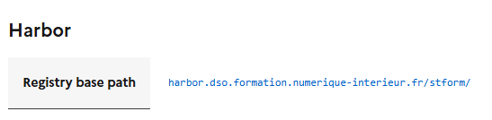
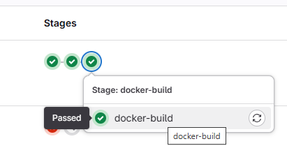
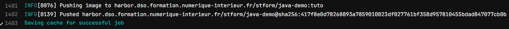
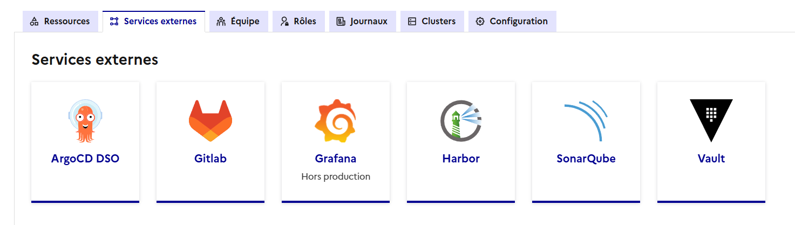
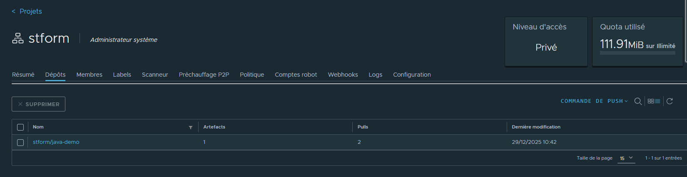
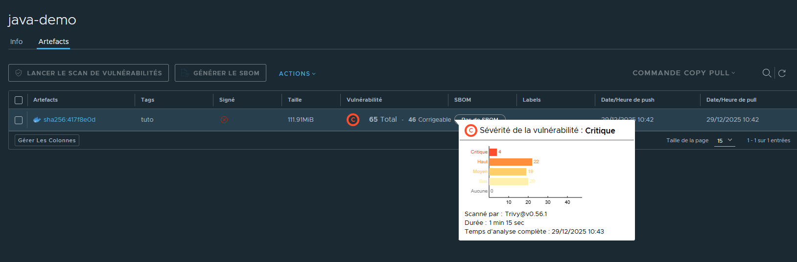

# Projet de tutoriel pour la gestion des artefacts sur CPiN

## Stockage des artefacts

Lors du build précédent, l'image docker créée se nomme java-demo et a été envoyé sur le gestionnaire d'artefacts de CPiN Harbor.

### Harbor

Harbor est le gestionnaire d'artefact de CPiN. A ce titre il stocke l'ensemble des images contruites via Gitlab-CI. Il est également possible de faire récupérer des images externes à travers Harbor, c'est notamment le cas lors d'utilisation d'images fournies par un éditeur dont le projet ou le ministère ne possède pas le code source.

Depuis la console CPiN, en cliquant sur le bouton ```Afficher les secrets des services``` il est possible de voir le nom et l'URL de son projet sur Harbor : 



Lors de l'étape de constuction du projet, il est également possible de voir l'upload de son image lors de la fin de l'étape de build : 

Pour cela, aller sur Gitlab puis sur le projet Java puis dans build -> piplines, passer la souris sur le dernier stage 'docker-build' et cliquer sur la coche verte



Puis cliquer sur l'étape Docker-build pour accéder aux logs de cette étape : 

La fin des logs indiquent l'étape d'upload de l'image sur Habror :



Enfin, depuis la console, dans l'onglet ```Services externes``` cliquez sur la tuile Harbor pour accéder directement à son espace projet sur Habror :



Lors du clic sur la tuile Habor, un nouvel onglet s'ouvre sur Habror sur son espace projet sur lequel on accède à ses images :



En cliquant sur son image, il est possible de voir les différents tags de son image, ici il n'y en a qu'un seul "tuto", il est égalmenet possible de voir les informations de signature de l'image, de taille et du rapport de vulnérabilité Trivy



Enfin, en cliquant sur le sha de l'image il est possible de voir le détail de l'image y compris la liste des vulnérabilité remontées par Trivy.

A noter qu'un dashboard dédié à Trivy sur Grafana est également présent dans les dashboards par défaut (au MI) 