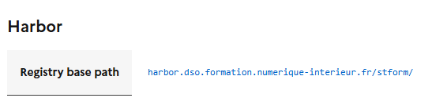
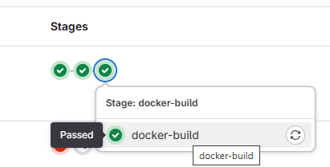
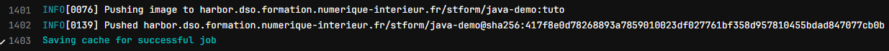
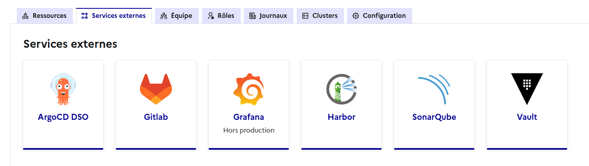
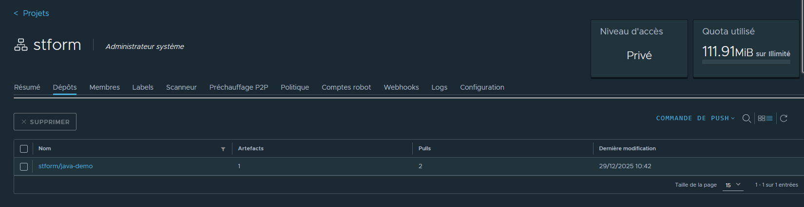
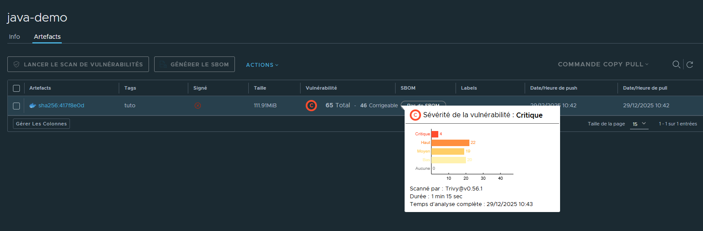

# Gestion des artefacts sur Cloud Pi Native

Vous en êtes à l'étape 3 de la formation CPiN :

1. [Gestion des projets CPiN](https://github.com/cloud-pi-native/formation-cpin-gestion-projet)
2. [Application d'exemple pour déploiement sur CPiN](https://github.com/cloud-pi-native/formation-cpin-repo-applicatif)
3. ➡️ [Gestion des artefacts sur CPiN](https://github.com/cloud-pi-native/formation-cpin-harbor-trivy)
4. [Chart Helm de démonstration sur CPiN](https://github.com/cloud-pi-native/formation-cpin-deploiement)
5. [Gestion des secrets sur CPiN](https://github.com/cloud-pi-native/formation-cpin-gestion-secret)
6. [Observabilité sur CPiN](https://github.com/cloud-pi-native/formation-cpin-observabilite)

## Stockage des artefacts

Lors du build précédent, l'image docker créée se nomme ***java-demo*** et a été envoyée sur le gestionnaire d'artefacts
de CPiN, Harbor.

### Harbor

Harbor est le gestionnaire d'artefacts de CPiN. À ce titre, il stocke l'ensemble des images construites via GitLab CI.
Il sert aussi de proxy pour les images externes, par exemple celles fournies par un éditeur, dont le projet ou le
ministère ne possède pas le code source.

Il est possible de récupérer les références Harbor des images construites de plusieurs façons :

#### Récupération depuis la console

▶️ Depuis la console CPiN, cliquez sur le bouton `Afficher les secrets des services`. Il est possible de voir
l'URL de son projet sur Harbor :

#### Récupération depuis GitLab CI

Depuis GitLab, lors de l'étape de construction du projet, il est possible de voir l'upload de son image dans les logs
du pipeline GitLab CI :

▶️ Pour cela, allez sur GitLab dans le dépôt *app-java* et dans le menu de gauche, sélectionnez `Build`>`Pipelines`.
Sur votre dernier build réussi, cliquez sur le stage *docker-build* pour ouvrir les logs.

La fin des logs indique l'étape d'upload de l'image sur Harbor. Vous y retrouvez l'URL d'upload de votre image :

#### Récupération depuis Harbor

▶️ Depuis la console, dans l'onglet `Services externes`, cliquez sur la tuile Harbor pour accéder directement à votre
espace projet :

Vous accédez directement à votre espace projet et vous pouvez y retrouver toutes vos images :

▶️ Cliquez sur votre image. Il est possible de voir les différents tags de votre image, dans notre cas, il n'y en a
qu'un seul : *tuto*. Il est également possible de voir les informations de signature de l'image, de taille et du nombre
de vulnérabilités *Trivy*.

▶️ Cliquez sur le digest (sha256) de l'image pour en afficher tous les détails. Vous y retrouvez la liste des
vulnérabilités remontées par Trivy.

> [!NOTE]
> Un dashboard dédié à Trivy sur Grafana est également présent dans les dashboards par défaut (au MI).

Bravo, vous avez terminé l'étape 3 de la formation CPiN sur Harbor et Trivy.

Vous pouvez passer à l'étape 4 : [Chart Helm de démonstration sur CPiN](https://github.com/cloud-pi-native/formation-cpin-deploiement)
